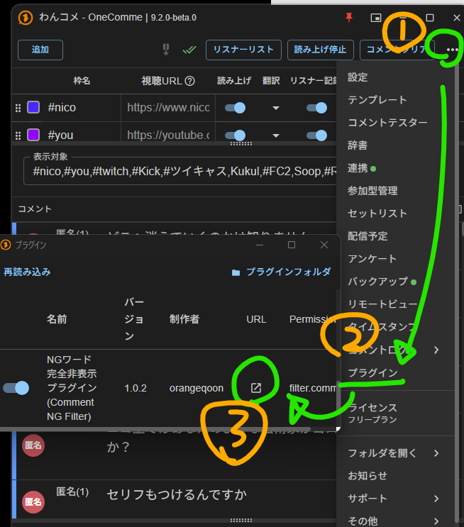

# NGワード完全非表示プラグイン for わんコメ (OneComme Comment NG Filter)

[わんコメ（OneComme）](https://onecomme.com/) で受信したコメントのうち、指定したNGワードやNGユーザーを含むコメントを、**わんコメ本体・OBSコメント描画・音声読み上げのすべてから完全に破棄（非表示）** する公式推奨設計プラグインです。

「わんコメ標準の文字列置換だと `*****` に置き換わるだけでコメント行そのものは残ってしまう」「特定の単語を含むコメントを行ごと完全に消去したい」という配信者のためのソリューションです。

---

## 主な機能

- **コメントの完全破棄（抹消）**:
  - わんコメ公式の `filter.comment`（`filterComment`）API を使用。
  - 条件に合致したコメントは **わんコメの画面上にも出ず、OBSのコメントジェネレーターにも表示されず、棒読みちゃんやVOICEVOXの音声読み上げも行われません**。
  - YouTube、Twitch、ニコニコ生放送、ツイキャス、Kick、FC2、Kukulu等、すべての連携プラットフォームに横断で適用されます。
- **専用Web設定画面（公式推奨設計）**:
  - 設定は **プラグイン一覧のURL**（歯車／URLリンク）から開きます。`plugin.url` は設定ページ（http://localhost:11180/plugins/com.orangeqoon.comment-ng-filter/index.html）を指します。

  - **設定 → コメント** には本プラグインの設定はありません（わんコメ標準の **文字列置換** とも別機能です。置換は伏せ字で行が残るのに対し、本プラグインはコメント行ごと完全破棄します）。
  - わんコメのプラグイン一覧から「設定」ボタン（歯車アイコンまたはURL）をクリックするだけで、ブラウザ上で直感的にNGワードを編集可能。
- **柔軟なマッチングモード**:
  - **部分一致**: コメント内にNGワードが含まれていれば除外（推奨設定）。
  - **完全一致**: コメント全体がNGワードそのものだった場合のみ除外。
  - **正規表現（RegEx）**: `/https?:\/\/[^\s]+/i` のように `/.../` で囲むことで、URL付きコメントや特定パターンを正規表現で除外可能。
- **安心の保護＆詳細設定**:
  - **ギフト・投げ銭の保護**: スーパーチャットやギフトコメントの誤爆除外を防止するトグル（デフォルトON）。
  - **ユーザー名チェック**: コメント本文だけでなく、ユーザー名にNGワードが含まれる場合も除外可能。
  - **NGユーザーID / NGユーザー名**: 特定の悪質ユーザーのコメントを丸ごと拒否。
- **除外ログ＆統計モニター**:
  - 検査総数、除外件数、除外遮断率（%）をリアルタイム表示。
  - 直近にどのコメントがどの理由で除外されたかを設定画面で一覧確認可能（誤爆確認も容易）。
- **ゼロ外部依存（Pure Node.js）**:
  - 外部npmパッケージを含まず、わんコメ本体を安定して動作させます。

---

## 導入手順

### 1. ダウンロードと配置
1. 本リポジトリ右上の **「Code」→「Download ZIP」**（または Releases）からZIPファイルをダウンロードし、解凍します。
2. わんコメを起動し、左上の **メニュー「≡」→「連携」→「プラグイン」** を開きます。
3. プラグイン一覧画面の **「フォルダを開く」** ボタンをクリックします。
   （エクスプローラーで `%APPDATA%\onecomme\plugins` が開きます）
4. 解凍したフォルダ（フォルダ名を `comment-filter` 等にリネーム推奨）をプラグインフォルダ内に配置します。

フォルダ構成のイメージ:
```text
plugins/
  comment-filter/
    plugin.js
    index.html
    config.sample.json
    package.json
    README.md
    LICENSE
```

### 2. 設定画面を開いてNGワードを登録
1. わんコメを再起動するか、プラグイン画面を再読み込みします。
2. **プラグイン一覧のURL**（歯車アイコンまたはURLリンク）から設定ページを開きます。**設定 → コメント** には本プラグインはありません（標準の文字列置換とは別です）。
   プラグイン一覧の **「NGワード完全非表示プラグイン」** の **「設定」ボタン（歯車アイコンまたはURL）** をクリックします。
   （ブラウザで `http://localhost:11180/plugins/com.orangeqoon.comment-ng-filter/index.html` が開きます）




*プラグイン一覧の URL（外部リンク）から設定画面を開く手順*

3. 「NGワード一覧」に除外したい単語を1行に1つずつ入力し、画面下の **「設定を保存する」** をクリックします。
4. これで設定完了です！以降の配信で該当ワードを含むコメントは一切表示・読み上げされなくなります。

---

## 設定項目一覧

| 設定項目 | 説明 | 初期値 |
| :--- | :--- | :--- |
| **機能 ON / OFF** | プラグインの有効・無効をワンクリックで切り替えます | `ON` |
| **NGワード一覧** | 1行に1単語ずつ入力します。空行は無視されます | なし |
| **一致方式** | `部分一致`（含まれていれば除外）または `完全一致`（全体一致のみ除外） | `部分一致` |
| **正規表現を有効にする** | `/パターン/フラグ` 形式の入力を正規表現として解釈します | `有効` |
| **ギフト・投げ銭は保護する** | スーパーチャット等の有料ギフトコメントは除外せず通過させます | `有効` |
| **大文字・小文字を厳密に区別** | 英字の大小（ABCとabc）を区別するかどうか | `無効`（区別しない） |
| **ユーザー名も検査対象にする** | 投稿者名にNGワードが含まれる場合もコメントを除外します | `無効` |
| **NGユーザーID一覧** | 指定したユーザーIDからの書き込みを無条件で除外します | なし |
| **NGユーザー名一覧** | 指定した投稿者名と完全一致する書き込みを無条件で除外します | なし |

---

## わんコメ利用規約に関する表記・クレジット

* 本プラグインは個人が開発した非公式の連携アプリケーション（コミュニティ製プラグイン）です。
* わんコメ（OneComme）公式の[利用規約](https://onecomme.com/terms/)に準拠して制作・配布されています。
* わんコメ本体を無料版でご利用の場合は、わんコメの利用規約に従い、適切なクレジット表示を行ってください。
* 「わんコメ」は合同会社アスタリスク（Asterisk, LLC）の登録商標または商標です。

---

## 免責事項

本ソフトウェアの使用によって生じた直接的、間接的、偶発的、特別または派生的な損害（意図しないコメントの除外や配信上のトラブルを含む）について、開発者は一切の責任を負いません。ご自身の責任においてご利用ください。

---

## ライセンス

[MIT License](LICENSE) (c) 2026 orangeqoon
